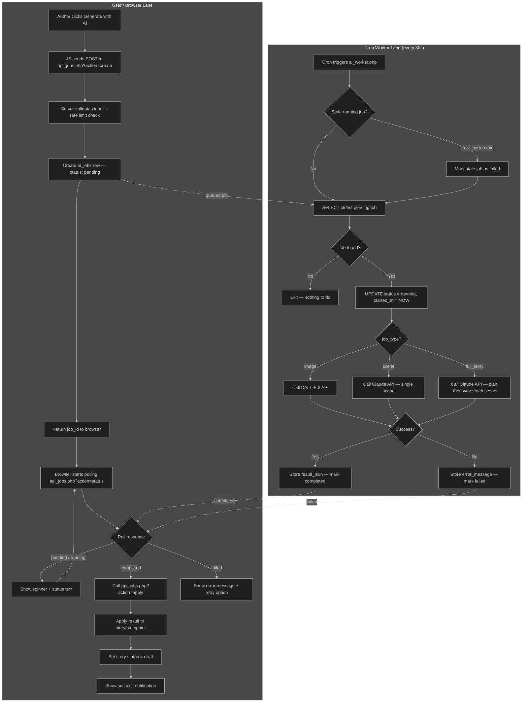
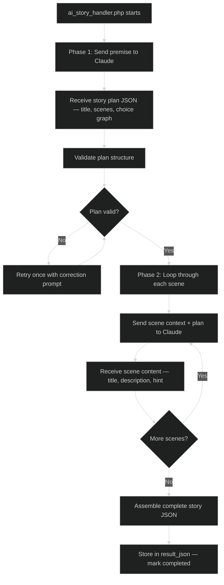
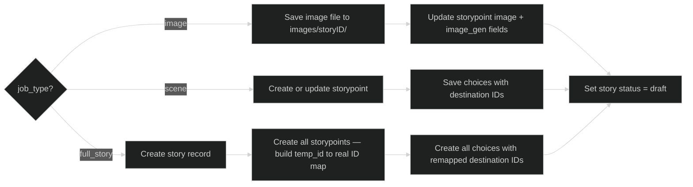

# AI Job Queue Flow

## Main Flow (All Job Types)

## Full Story Generation Detail (Level 3)

## Result Application Detail

## File Map

| File | Role |
|------|------|
| `api_jobs.php` | Browser-facing API (create, status, apply, cancel, retry, list) |
| `cron/ai_worker.php` | Cron entry point — picks up jobs, dispatches to handlers |
| `cron/ai_image_handler.php` | DALL-E API call + image download |
| `cron/ai_scene_handler.php` | Claude API call for single scene |
| `cron/ai_story_handler.php` | Claude API call for full story (two-phase) |
| `cron/ai_apply.php` | Functions to write results into story/storypoint tables |
