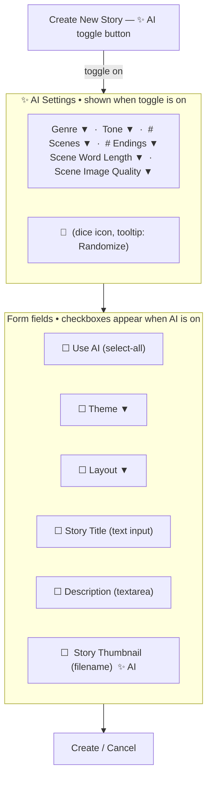
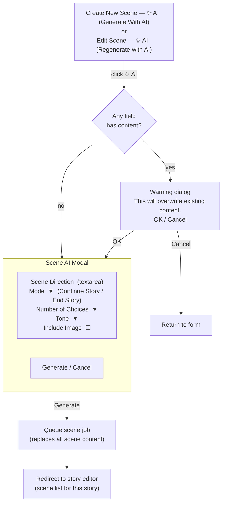
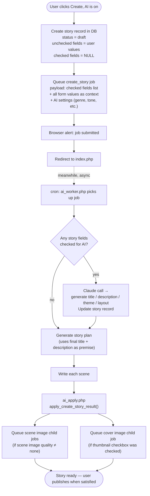
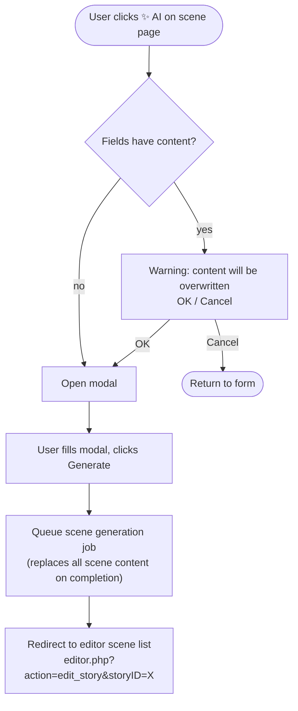

# Implementation Plan 3 — AI Integration Redesign

## Overview 

This plan replaces the earlier two-tab story properties redesign with a broader rework of
how AI is integrated across all editor pages. Key design principles:

- AI is opt-in and never blocks the manual workflow
- Story creation with AI is fully async (background job); the user is redirected immediately
- Scene AI uses a modal; scene thumbnail AI uses an inline expandable section
- Edit Story Properties is simplified — the only AI available is cover image regeneration
- The old tab structure, Generate Everything chain, and synchronous `api_ai_properties.php`
  flow are retired entirely

---

## Phase 17 — Admin Settings Table & Config Migration

Foundation phase. All subsequent phases that reference configurable values (model selection,
pricing, job settings, site title) read from this table instead of `config.php`.
Implement this before any other phase.

### Design notes

- **Settings loaded once per request** into a global `$SETTINGS` array; a thin helper
  `app_setting(string $key, mixed $default = null)` reads from that array
- **Constants re-defined from DB values** at load time for backwards compatibility —
  existing code using `ANTHROPIC_API_KEY` etc. continues to work unchanged
- **`config.php` retains** only values needed before DB connect: DB credentials,
  SMTP/email config, `APP_URL`
- **Pricing reference data** (`AI_IMAGE_PRICING` array) stays in `config.php` — it is
  not admin-editable, just a lookup table for cost calculations
- **API keys** displayed masked in the admin panel; full value only sent in POST when
  the admin explicitly changes them — empty POST field means no change

### Settings migrated from config.php to DB

| Setting key | Type | Default | Admin label |
|---|---|---|---|
| `anthropic_api_key` | string (sensitive) | — | Anthropic API Key |
| `openai_api_key` | string (sensitive) | — | OpenAI API Key |
| `anthropic_model` | select | `claude-sonnet-4-6` | Claude Model |
| `openai_image_model` | select | `gpt-image-2` | Image Model |
| `openai_image_quality` | select | `medium` | Default Image Quality |
| `scene_thumb_size` | int | `200` | Scene Thumbnail Size (px) |
| `ai_enabled` | bool | `1` | AI Processing Enabled |
| `ai_job_timeout_seconds` | int | `300` | Job Timeout (seconds) |
| `ai_max_pending_per_user` | int | `5` | Max Pending Jobs Per User |
| `app_title` | string | `Choose Your Own Adventure!` | Site Title |

`app_title` lives here rather than in Phase 19 (header redesign) since it is a natural
admin-configurable value; Phase 19 reads it from `$SETTINGS['app_title']`.

### Task breakdown

#### 17.1 — Schema

```sql
CREATE TABLE cyoa_ai_settings (
    setting_key   VARCHAR(64)  NOT NULL,
    setting_value TEXT         NULL,
    updated_at    DATETIME     NOT NULL DEFAULT CURRENT_TIMESTAMP ON UPDATE CURRENT_TIMESTAMP,
    PRIMARY KEY (setting_key)
) ENGINE=InnoDB DEFAULT CHARSET=utf8mb4;

INSERT INTO cyoa_ai_settings (setting_key, setting_value) VALUES
    ('anthropic_api_key',        ''),
    ('openai_api_key',           ''),
    ('anthropic_model',          'claude-sonnet-4-6'),
    ('openai_image_model',       'gpt-image-2'),
    ('openai_image_quality',     'medium'),
    ('scene_thumb_size',         '200'),
    ('ai_enabled',               '1'),
    ('ai_job_timeout_seconds',   '300'),
    ('ai_max_pending_per_user',  '5'),
    ('app_title',                'Choose Your Own Adventure!');
```

Add to `.claude/migration_3.sql`.

> **Deployment note:** API keys are seeded as empty strings and must be entered manually
> via the admin Site Settings panel after running the migration. All other settings seed
> with their default values and work immediately without manual intervention.

#### 17.2 — DB helper functions

Add to `db_functions.php` under an `// === Settings ===` section header:

- **`db_get_all_settings(): array`** — SELECT all rows, return as `[key => value]` map
- **`db_set_setting(string $key, string $value): void`** — INSERT … ON DUPLICATE KEY UPDATE

#### 17.3 — Settings bootstrap (`settings.php`)

New file `settings.php`, included on every page immediately after `require_once 'db_functions.php'`.
No constants are defined — all code uses `app_setting()` directly. Defaults live here in one
place; changing a default requires no sweep of call sites.

```php
<?php
global $SETTINGS;
$SETTINGS = db_get_all_settings();

const SETTING_DEFAULTS = [
    'anthropic_model'         => 'claude-sonnet-4-6',
    'openai_image_model'      => 'gpt-image-2',
    'openai_image_quality'    => 'medium',
    'scene_thumb_size'        => '200',
    'ai_enabled'              => '1',
    'ai_job_timeout_seconds'  => '300',
    'ai_max_pending_per_user' => '5',
    'app_title'               => 'Choose Your Own Adventure!',
    // anthropic_api_key and openai_api_key intentionally omitted — null if not configured
];

function app_setting(string $key): ?string {
    global $SETTINGS;
    return $SETTINGS[$key] ?? SETTING_DEFAULTS[$key] ?? null;
}
```

Call sites use `app_setting('key')` with no default argument. Type casting where needed is
the caller's responsibility and is explicit at the point of use:

```php
app_setting('openai_image_model')          // string — no cast needed
(int)  app_setting('scene_thumb_size')     // cast once at point of use
(bool)(int) app_setting('ai_enabled')      // bool via int intermediate
```

#### 17.3a — Code migration sweep

Replace all remaining references to the old constants across the codebase:

| Old constant | New call |
|---|---|
| `ANTHROPIC_API_KEY` | `app_setting('anthropic_api_key')` |
| `OPENAI_API_KEY` | `app_setting('openai_api_key')` |
| `ANTHROPIC_MODEL` | `app_setting('anthropic_model')` |
| `OPENAI_IMAGE_MODEL` | `app_setting('openai_image_model')` |
| `OPENAI_IMAGE_QUALITY` | `app_setting('openai_image_quality')` |
| `SCENE_THUMB_SIZE` | `(int) app_setting('scene_thumb_size')` |
| `AI_ENABLED` | `(bool)(int) app_setting('ai_enabled')` |
| `AI_JOB_TIMEOUT_SECONDS` | `(int) app_setting('ai_job_timeout_seconds')` |
| `AI_MAX_PENDING_PER_USER` | `(int) app_setting('ai_max_pending_per_user')` |

Grep for each constant name to find all occurrences before replacing.

#### 17.4 — config.php cleanup

Remove the migrated settings from `config.php`. Keep:
- DB credentials (`DB_HOST`, `DB_USER`, `DB_PASSWORD`, `DB_NAME`, `DB_PREFIX`)
- SMTP / email settings
- `APP_URL`
- `AI_IMAGE_PRICING` array (reference data — not admin-editable):

```php
// Per-image output cost at 1024×1024 (source: OpenAI pricing page)
define('AI_IMAGE_PRICING', [
    'gpt-image-1-mini' => ['low' => 0.005, 'medium' => 0.011, 'high' => 0.036],
    'gpt-image-1'      => ['low' => 0.011, 'medium' => 0.042, 'high' => 0.167],
    'gpt-image-1.5'    => ['low' => 0.009, 'medium' => 0.034, 'high' => 0.133],
    'gpt-image-2'      => ['low' => 0.006, 'medium' => 0.053, 'high' => 0.211],
]);

// Claude token rates (claude-sonnet-4-6, per 1M tokens)
define('AI_COST_INPUT_PER_M',   3.00);
define('AI_COST_OUTPUT_PER_M', 15.00);
```

#### 17.5 — Admin panel: Site Settings section

Add a "Site Settings" section to `account.php` (admin only). Grouped into four areas:

**API Keys**
- Anthropic API Key — password-style input, placeholder shows masked value; blank = no change
- OpenAI API Key — same

**AI Generation**
- Claude Model — dropdown: `claude-haiku-4-5`, `claude-sonnet-4-6`, `claude-opus-4-7`
- Image Model — dropdown: `gpt-image-1-mini`, `gpt-image-1`, `gpt-image-1.5`, `gpt-image-2`
- Default Image Quality — dropdown: `low`, `medium`, `high`

**Job Queue**
- AI Processing Enabled — checkbox
- Job Timeout (seconds) — number input
- Max Pending Jobs Per User — number input

**Appearance**
- Site Title — text input
- Scene Thumbnail Size (px) — number input

POST handler calls `db_set_setting()` for each field; skips API key fields if submitted empty.

### Files to change

| File | Change |
|---|---|
| `.claude/migration_3.sql` | **New file** — CREATE TABLE + seed INSERT for settings table |
| `db_functions.php` | Add `db_get_all_settings()`, `db_set_setting()` |
| `settings.php` | **New file** — `SETTING_DEFAULTS`, `app_setting()` helper |
| `config.php` | Remove migrated settings; keep DB/email/URL + `AI_IMAGE_PRICING` + Claude rates |
| `account.php` | Add Site Settings section (admin only) |
| All pages | Add `require_once 'settings.php'` after `require_once 'db_functions.php'` |
| All files referencing old constants | Replace with `app_setting()` calls (task 17.3a sweep) |

---

## Phase 18 — Story & Scene AI Integration Redesign

### Page: Create New Story



**AI toggle off:** Checkboxes hidden, all fields editable normally. Form saves manually.

**AI toggle on:**
- Checkboxes appear in front of each field
- "Use AI" at top is a select-all
- Checked fields → read-only, placeholder text `generated`
- Unchecked fields → normal input; values feed into the AI job as context
- Dice button randomizes all AI dropdowns **and** Theme + Layout dropdowns

**Story Thumbnail `[✨ AI]` button** (always present, AI on or off):
- Expands an inline section with: description field (placeholder `use story description`),
  image quality dropdown, Submit button
- Expanded section has a slight background shade for visual separation
- When AI is **on** and the thumbnail **checkbox** is checked:
  - If an image already exists → confirm overwrite dialog before checking takes effect
  - On confirmation: collapses the expanded AI section, grays out the filename field,
    disables the `[✨ AI]` button (thumbnail will be generated by the main job)

**Create button with AI on:**
1. Creates the story record in the DB as `draft`; unchecked field values are saved immediately;
   checked fields left NULL/empty until the job fills them
2. Queues a `create_story` background job (see task 18.9)
3. Shows a browser alert: `Story creation job submitted. You'll find it in your stories once it's ready.`
4. On acknowledgement: redirects to the public gallery (`index.php`)
5. Story stays `draft` until the user manually publishes it

---

### Page: Edit Story Properties

No AI toggle. No checkboxes. Standard form only.

Field order (same as Create New Story for consistency):
Theme → Layout → Story Title → Description → Story Thumbnail

**Story Thumbnail `[✨ AI]` button** (same behaviour as Create New Story, minus the checkbox):
- Expands inline section: description (placeholder `use story description`), quality, Submit
- Submits an async image job for the story cover; does not affect other fields

**Save button:** Normal save. No AI involvement.

---

### Pages: Create New Scene / Edit Scene



**Scene Thumbnail `[✨ AI]` button** (to the right of the filename selector):
- Tooltip: `Generate image with AI`
- Expands inline section: description (placeholder `use scene description`), quality, Submit
- Expanded section has a slight background shade
- Submits an async image-only job; does not affect scene text or choices

---

## Flows

### Create Story with AI



### Scene AI Modal



---

## Task breakdown

### 18.1 — Form field reorder

Reorder the story properties form fields on **both** Create New Story and Edit Story Properties:

**New order:** Theme → Layout → Story Title → Description → Story Thumbnail

This puts Theme and Layout directly below the AI settings section (when visible) so randomized
values are immediately adjacent to the dropdowns that show them.

### 18.2 — Create New Story: AI toggle + settings section

- Add `[✨ AI]` toggle button to the right of the `<h3>Create New Story</h3>` heading
- Button style: filled purple with yellow/white text; lighter shade when active
- `toggleStoryAI()` in JS: shows/hides `#story-ai-section`; updates button appearance;
  shows/hides the "Use AI" checkboxes; persists state to `localStorage` key `cyoa_story_ai_open`
- `#story-ai-section` contains:
  - Genre, Tone, Number of Scenes, Number of Endings, Scene Word Length, Scene Image Quality dropdowns
  - Dice `🎲` button (tooltip `Randomize`) calling `randomizeStoryAI()`
- `randomizeStoryAI()` — sets all AI dropdowns **and** the Theme + Layout dropdowns in the main form;
  no API calls, no jobs

**Randomization pools:**
```js
const GENRES   = ['fantasy','sci-fi','mystery','horror','adventure','historical','romance','contemporary'];
const TONES    = ['suspenseful','hopeful','dark','humorous','mysterious','neutral'];
const LENGTHS  = ['8','12','16'];
const ENDINGS  = ['2','3','4'];
const WORDS    = ['50','100','200'];
const QUALITY  = ['none','low','medium','high'];
const THEMES   = ['egyptian','forest','scifi','ocean','desert'];
const LAYOUTS  = ['image_left','image_right','image_top'];
```

### 18.3 — Create New Story: "Use AI" checkboxes

When `#story-ai-section` is visible:

- Show a `☐ Use AI` select-all checkbox above the first form field
- Show individual checkboxes in front of: Theme, Layout, Story Title, Description, Story Thumbnail
- Checking a field: sets its input to `readonly`, clears its value, sets placeholder to `generated`
- Unchecking a field: restores editable state, clears placeholder
- Select-all: checks/unchecks all individual checkboxes

**Thumbnail checkbox special behaviour:**
- If an image filename is already present when the thumbnail checkbox is checked:
  show a confirm dialog `This will replace the existing image. Continue?`
  - Cancel: leaves checkbox unchecked
  - OK: collapse `#story-thumb-ai-expand` if open; set filename field to readonly + gray;
    disable `[✨ AI]` button; placeholder `generated`
- When thumbnail checkbox is unchecked: restore filename field and `[✨ AI]` button

When `#story-ai-section` is hidden (AI toggled off): all checkboxes hidden, all fields editable.

### 18.4 — Story Thumbnail `[✨ AI]` button (Create + Edit Story pages)

- Small `[✨ AI]` button placed immediately to the right of the filename input
- Tooltip: `Generate image with AI`
- Clicking toggles `#story-thumb-ai-expand` (inline expandable div)
- Expanded section contains:
  - Description textarea (placeholder `use story description`; when blank the job uses the
    story's saved description field as the image prompt)
  - Image quality dropdown
  - `[Generate Image]` submit button
- Expanded section has a distinct background shade (`var(--bg-light)` with a border)
- Submit queues an async `story_cover` image job; shows a small inline status message;
  does not navigate away

### 18.5 — Create button: story creation + job queuing

On form submit when AI toggle is on:

1. Collect which checkboxes are checked (array of field names)
2. POST to a new `api_create_story_ai.php` endpoint:
   - All form field values (for context)
   - Checked fields list
   - AI settings (genre, tone, scene count, endings, word length, image quality)
3. Endpoint creates story record (`status = draft`), saves unchecked field values, leaves
   checked fields NULL, inserts `create_story` job row, returns `{ ok: true, storyID: X }`
4. JS shows `alert()` with submission message
5. On acknowledgement: `window.location = 'index.php'`

When AI toggle is off: form submits normally via POST (existing save_story handler); no change
to current create-story flow.

### 18.6 — Edit Story Properties: simplify

- Remove all tab markup, AI dropdowns, premise textarea, and all Generate buttons
- Form contains only: Theme, Layout, Story Title, Description, Story Thumbnail (in that order)
- Thumbnail `[✨ AI]` button from task 18.4 is present
- Save button: unchanged, submits existing `save_story` POST handler

### 18.7 — Scene pages: AI modal button

- Add `<button class="btn-ai-inline" id="btn-scene-ai">✨ AI</button>` to the right of the
  scene page `<h3>` heading
- Tooltip: `Generate With AI` (create) or `Regenerate with AI` (edit)
- Click handler `openSceneAIModal()`:
  1. Check if any scene field (title, description, choices, image) has non-default content
  2. If yes: show confirm dialog `This will overwrite the current scene content. Continue?`
     - Cancel: do nothing
     - OK: open modal
  3. If no existing content: open modal directly
- Modal (`#scene-ai-modal`) contains:
  - Scene Direction textarea
  - Mode dropdown (Continue Story / End Story)
  - Number of Choices dropdown
  - Tone dropdown
  - Include Image checkbox
  - `[Generate]` and `[Cancel]` buttons
- Generate: POST to `api_jobs.php` with scene generation parameters;
  on success redirect to `editor.php?action=edit_story&storyID=<?= $storyID ?>`
- AI replaces all scene content (title, description, choices, image) on completion

### 18.8 — Scene Thumbnail `[✨ AI]` button (scene pages)

Same pattern as task 18.4 but for scene pages:

- `[✨ AI]` button to the right of the scene image filename selector
- Tooltip: `Generate image with AI`
- Expands `#scene-thumb-ai-expand` with: description (placeholder `use scene description`),
  quality dropdown, `[Generate Image]` button
- Submit queues an async scene image job; shows inline status; does not navigate away

### 18.9 — New job type: `create_story`

New cron handler to process `create_story` jobs. Extend `ai_worker.php` to route this type.

**Job payload (stored in `jobs.input_json` JSON):**
```json
{
  "story_id": 42,
  "generate_fields": ["title", "description", "theme"],
  "context": { "title": "user value or null", "description": "...", "theme": "forest", "layout": "image_left" },
  "ai_settings": { "genre": "fantasy", "tone": "dark", "scene_count": 8, "endings": 2, "word_length": 100, "image_quality": "medium" },
  "generate_cover": true
}
```

**Handler phases (`cron/ai_story_handler.php` extended or new file):**

1. **Properties phase** (if `generate_fields` is non-empty):
   - Call Claude with genre + tone + context values → generate only the checked fields
   - Update story record with generated values

2. **Story plan phase:**
   - Call Claude with final title + description + AI settings → story outline (scene titles + summaries)

3. **Scene write phase:**
   - For each scene in the plan: write full scene content
   - Insert scene rows into DB

4. **Apply phase (`ai_apply.php` → `apply_create_story_result()`):**
   - Mark parent job complete
   - If `image_quality !== 'none'`: queue one `scene_image` child job per scene
   - If `generate_cover === true`: queue one `story_cover` child job

### 18.10 — Remove old structure

Remove from `editor.php`:
- `.story-form-tabs` markup and the two tab wrapper divs
- `#ai-premise` textarea
- `Generate Story Properties`, `Generate Scenes`, `Generate Everything` buttons
- Any "how it works" explanation paragraph from the old Tab 2

Remove from editor JS:
- `switchStoryTab()`
- `generateProperties()`
- `generateScenes()`
- `generateEverything()`
- `randomizeAll()` → replaced by `randomizeStoryAI()` (task 18.2)

`api_ai_properties.php` — no longer called from the UI after this phase (new flow is async
via `api_create_story_ai.php`). Move to `retired/` — see task 18.12.

### 18.11 — CSS updates

**Remove / deprecate:**
- `.story-form-tabs`, `.story-tab-btn` (keep in file but comment as deprecated)

**Add:**
- `.story-ai-section` — AI settings panel:
  `background: var(--bg-light); border: 1px solid var(--border); border-radius: var(--radius);
  padding: 1.25rem; margin-bottom: 1.5rem;`
- `.story-ai-header` — flex row, space-between: label left, dice button right
- `.story-ai-dropdowns` — grid or flex-wrap of label+select pairs
- `.use-ai-checklist` — the checkbox column beside the form fields
- `.thumb-ai-expand` — expandable image AI section:
  `background: var(--bg-light); border: 1px solid var(--border); border-radius: var(--radius);
  padding: 1rem; margin-top: 0.5rem;`
- `.btn-ai-inline` — the `[✨ AI]` pill button used beside headings and file inputs:
  small, outlined, purple accent
- `#scene-ai-modal` — modal overlay styles (fixed, dark backdrop, centered card)
- `.field-ai-checked` — applied to readonly AI-checked inputs: `opacity: 0.55; background: var(--bg-light);`

### 18.12 — File retirement

Move the following files to a `retired/` subfolder at the project root. The folder acts as a
temporary holding area — files are kept for reference until all functionality has been confirmed,
then deleted.

| File | Reason |
|---|---|
| `api_ai_properties.php` | Replaced by async `api_create_story_ai.php` (task 18.5) |
| `generate_story.php` | Already superseded (redirects to `editor.php`); no longer needed |

Create the `retired/` folder if it does not exist. No code changes needed — these files are
simply moved, not modified.

---

## What changes vs what stays the same

| Item | Status |
|---|---|
| `editor.php` story form — tab structure | **Removed** |
| `editor.php` — Create New Story form | **Reworked** (18.1–18.5) |
| `editor.php` — Edit Story Properties form | **Simplified** (18.6) |
| `editor.php` — Create/Edit Scene form | **Modal button added** (18.7–18.8) |
| `api_ai_properties.php` | **Retired** — moved to `retired/` (18.12) |
| `generate_story.php` | **Retired** — moved to `retired/` (18.12) |
| `api_jobs.php` | **Unchanged** (still used by scene modal) |
| `api_create_story_ai.php` | **New file** (18.5) |
| `cron/ai_worker.php` | **Minor: route new create_story type** |
| `cron/ai_story_handler.php` | **Extended: properties phase added** |
| `cron/ai_apply.php` | **Extended: apply_create_story_result()** |
| `generateProperties()` / `generateScenes()` / `generateEverything()` | **Removed** |
| `randomizeAll()` → `randomizeStoryAI()` | **Renamed + scoped to story create page** |
| `switchStoryTab()` | **Removed** |
| Scene generation job type + handlers | **Unchanged** |
| Cover image job type | **Unchanged** |
| Play page | **Unchanged** |
| `save_story` POST handler | **Unchanged** |

---

## Files to change

| File | Change |
|---|---|
| `editor.php` | Rework story form (18.1–18.6), add scene AI modal + thumbnail buttons (18.7–18.8) |
| `styles/editor.css` | Remove tab styles, add AI panel + modal + thumbnail expand styles (18.11) |
| `api_create_story_ai.php` | **New** — create draft story record + queue create_story job |
| `cron/ai_worker.php` | Route `create_story` job type to new handler |
| `cron/ai_story_handler.php` | Add properties generation phase for `create_story` jobs |
| `cron/ai_apply.php` | Add `apply_create_story_result()` |

---

## Phase 19 — Header Redesign

Separate phase. No dependency on Phase 18. Reads `app_title` from `$SETTINGS` (set in Phase 17).

### Changes

1. **Height:** Increase header height by 60px; scale logo, title text, and icon sizes to match

2. **Title text:** Read from `app_setting('app_title')` — default `Choose Your Own Adventure!`,
   configurable via the admin Site Settings panel (Phase 17)

3. **Remove Explore button** from the nav

4. **Search bar:** Move the search input + button from the gallery page (`index.php`) into
   the header; center it horizontally and vertically within the header;
   set input width to one-third of header width

5. **User name:** Move the logged-in user's display name from inside the account dropdown
   to a fixed position in the header, below the profile icon

6. **Admin icon:** Replace the shield icon (shown when an admin is logged in) with a cog
   wheel icon (⚙). Remove the dropdown — clicking the icon links directly to `account.php`
   (the admin panel). No intermediary menu.

### Files to change

| File | Change |
|---|---|
| `header.php` | Height, read app_title from settings, remove Explore, add search bar, add username display, replace shield with cog link |
| `styles/header.css` (or equivalent) | Height, scaling, search bar layout, username positioning |
| `index.php` | Remove search bar markup (now lives in header) |

---

## Phase 20 — AI Job Cost Tracking

No dependency on Phase 18 or 19. Depends on Phase 17 (settings table provides active model
and pricing reference). Phase 18's `create_story` job type picks up cost tracking automatically
once its handlers call `db_update_job_cost()`.

### Design notes

- **Cost stored at completion time**, not calculated at display time. If pricing changes later,
  historical jobs still show what they actually cost when they ran.
- **gpt-image-2 is billed per image** (output cost), with quality as the main cost driver.
  A small additional input token cost applies (text prompt length) but is negligible for
  typical prompts — per-image lookup from `AI_IMAGE_PRICING` is a sufficient approximation.
  `image_count = 1` per image job; `input_tokens` / `output_tokens` left NULL for image jobs.
- **Chains in this app are max 2 levels deep** (parent → child jobs, never grandchildren),
  so `db_get_chain_cost()` can use a simple self-join rather than a recursive CTE.
- **Partial running total** — show accumulated cost even while a chain is still in progress,
  with a `…` suffix to signal it isn't final yet. Hide the label only when cost is genuinely
  zero (e.g. a text-only job that hasn't completed).

### Task breakdown

#### 20.1 — Schema

Add to `.claude/migration_3.sql`:

```sql
ALTER TABLE cyoa_ai_jobs
    ADD COLUMN input_tokens  INT            NULL AFTER parent_job_id,
    ADD COLUMN output_tokens INT            NULL AFTER input_tokens,
    ADD COLUMN image_count   INT            NULL AFTER output_tokens,
    ADD COLUMN cost_usd      DECIMAL(10,6)  NULL AFTER image_count;
```

#### 20.2 — Cost rate constants

Claude token rates are already in `config.php` from Phase 17. Image pricing is already in
the `AI_IMAGE_PRICING` array. No additional constants needed for this phase.

At runtime, image cost is looked up as:
```php
$model = app_setting('openai_image_model');
$cost  = AI_IMAGE_PRICING[$model][$quality] ?? AI_IMAGE_PRICING['gpt-image-2']['medium'];
```

#### 20.3 — DB helper functions

Add to `db_functions.php` (under an `// === AI Job Costs ===` section header):

**`db_update_job_cost(int $jobID, int $inputTokens, int $outputTokens, int $imageCount, float $costUsd): void`**
- UPDATE the job row with the four cost columns
- Called at the end of each cron handler phase that makes an API call

**`db_get_chain_cost(int $jobID): ?float`**
- Find the root job: if the given job has a `parent_job_id`, that parent is the root;
  otherwise the given job is the root (chains are max 2 levels)
- Return `SUM(cost_usd)` across the root job and all rows where `parent_job_id = root_id`
- Return `null` if all matching `cost_usd` values are NULL (chain hasn't logged any cost yet)
- Return the partial sum (non-null rows only) if some children are still in progress

```sql
-- root lookup (run once to get root_id)
SELECT COALESCE(parent_job_id, job_id) AS root_id
FROM cyoa_ai_jobs WHERE job_id = ?

-- cost sum
SELECT SUM(cost_usd)
FROM cyoa_ai_jobs
WHERE job_id = ? OR parent_job_id = ?
```

#### 20.4 — Log usage in cron workers

In each cron handler that makes an API call, capture usage data from the response and
call `db_update_job_cost()` before marking the job complete.

**Claude API responses** (`ai_story_handler.php` and any scene text handler):
```php
$inputTokens  = $response['usage']['input_tokens']  ?? 0;
$outputTokens = $response['usage']['output_tokens'] ?? 0;
$costUsd = (($inputTokens  / 1_000_000) * AI_COST_INPUT_PER_M)
         + (($outputTokens / 1_000_000) * AI_COST_OUTPUT_PER_M);
db_update_job_cost($jobID, $inputTokens, $outputTokens, 0, $costUsd);
```

**gpt-image-2 API responses** (scene image and story cover handlers):
```php
// Per-image cost looked up from AI_IMAGE_PRICING using the active model from settings
$model   = app_setting('openai_image_model');
$costUsd = AI_IMAGE_PRICING[$model][$quality] ?? AI_IMAGE_PRICING['gpt-image-2']['medium'];
db_update_job_cost($jobID, 0, 0, 1, $costUsd);
```

Workers to update:
- `cron/ai_story_handler.php` — one call per Claude phase (properties, plan, each scene write)
- `cron/ai_apply.php` — image child job handlers (scene image, story cover)
- Any other cron file that calls the Claude or OpenAI API directly

#### 20.5 — Display in UI

Wherever the job queue renders completed or in-progress jobs, show the chain cost for
**parent jobs only**. Child jobs show no cost label.

**Logic:**
```php
if (empty($job['parent_job_id'])) {          // only for root jobs
    $chainCost = db_get_chain_cost($job['id']);
    if ($chainCost !== null && $chainCost > 0) {
        $isComplete = /* all child jobs done */;
        $label = '$' . number_format($chainCost, 4);
        if (!$isComplete) $label .= ' …';    // partial — chain still running
        // render $label as a small muted span
    }
}
```

**CSS:** Add `.job-cost` class — small, muted, monospace:
```css
.job-cost {
    font-size: 0.78rem;
    color: var(--text-light);
    font-family: monospace;
    margin-left: 0.5rem;
}
```

### Files to change

| File | Change |
|---|---|
| `.claude/migration_3.sql` | Add ALTER TABLE for cost columns |
| `db_functions.php` | Add `db_update_job_cost()` and `db_get_chain_cost()` |
| `cron/ai_story_handler.php` | Call `db_update_job_cost()` after each Claude API call |
| `cron/ai_apply.php` | Call `db_update_job_cost()` in image job handlers |
| Job queue display template/page | Render chain cost label for root jobs |
| `styles/editor.css` (or equivalent) | Add `.job-cost` style |

---

## Phase 21 — Extract AI Prompts to External Files

Moves all system prompt text out of PHP handler files and into standalone `.txt` template files
in a new `prompts/` directory. Prompts that contain dynamic values use `{PLACEHOLDER}` tokens
that are substituted in PHP via `str_replace()`.

**Goal:** Prompts can be edited, version-controlled, and read without opening PHP source. No
behavioural changes — only where the text lives.

---

### 21.1 — Create `prompts/` directory and template files

Create the following files (paths relative to the project root):

#### `prompts/image_system.txt`

```
Generate an illustration for a choose-your-own-adventure story.
{THEME_LINE}Style: Digital illustration, vivid colours, suitable for a web story.
Do not include any text or lettering in the image.
```

`{THEME_LINE}` is replaced in PHP with `"Theme: $theme. {$themeStyles[$theme]}
"` when a
theme is set, or an empty string when no theme applies.

#### `prompts/scene_system.txt`

Exact content of the current `build_scene_system_prompt()` return value — copy the nowdoc
body verbatim (do not add or change any text).

#### `prompts/story_plan_system.txt`

Exact content of the current `build_plan_system_prompt()` heredoc body, with the two PHP
variable references replaced by placeholders:
- `$targetScenes` → `{TARGET_SCENES}`
- `$numEndings` → `{NUM_ENDINGS}`

#### `prompts/story_scene_writer_system.txt`

Exact content of the current `build_scene_writer_system_prompt()` heredoc body, with the
three PHP variable references replaced by placeholders:
- `$sceneType` → `{SCENE_TYPE}`
- `$tone` → `{TONE}`
- `$wordLength` → `{WORD_LENGTH}`

---

### 21.2 — Helper function: `load_prompt()`

Add to `db_functions.php` (or a new `prompts.php` included by the cron bootstrap) a small
helper that loads a template file and performs placeholder substitution:

```php
function load_prompt(string $name, array $vars = []): string {
    $path = __DIR__ . '/prompts/' . $name . '.txt';
    $text = file_get_contents($path);
    if ($text === false) {
        throw new RuntimeException("Prompt file not found: $name");
    }
    if ($vars) {
        $search  = array_map(fn($k) => '{' . strtoupper($k) . '}', array_keys($vars));
        $replace = array_values($vars);
        $text    = str_replace($search, $replace, $text);
    }
    return $text;
}
```

---

### 21.3 — Update `cron/ai_scene_handler.php`

Replace `build_scene_system_prompt()`:

```php
// Before
function build_scene_system_prompt(): string {
    return <<<'PROMPT'
    ... (entire nowdoc body) ...
    PROMPT;
}

// After
function build_scene_system_prompt(): string {
    return load_prompt('scene_system');
}
```

---

### 21.4 — Update `cron/ai_story_handler.php`

Replace `build_plan_system_prompt()`:

```php
// Before
function build_plan_system_prompt(int $targetScenes, int $numEndings): string {
    return <<<PROMPT
    ... (heredoc with $targetScenes / $numEndings) ...
    PROMPT;
}

// After
function build_plan_system_prompt(int $targetScenes, int $numEndings): string {
    return load_prompt('story_plan_system', [
        'target_scenes' => $targetScenes,
        'num_endings'   => $numEndings,
    ]);
}
```

Replace `build_scene_writer_system_prompt()`:

```php
// Before
function build_scene_writer_system_prompt(string $sceneType, string $tone, int $wordLength = 100): string {
    return <<<PROMPT
    ... (heredoc with $sceneType / $tone / $wordLength) ...
    PROMPT;
}

// After
function build_scene_writer_system_prompt(string $sceneType, string $tone, int $wordLength = 100): string {
    return load_prompt('story_scene_writer_system', [
        'scene_type'  => $sceneType,
        'tone'        => $tone,
        'word_length' => $wordLength,
    ]);
}
```

---

### 21.5 — Update `cron/ai_image_handler.php`

Replace the inline `$systemCtx` construction:

```php
// Before
$systemCtx  = "Generate an illustration for a choose-your-own-adventure story.
";
if (isset($themeStyles[$theme])) {
    $systemCtx .= "Theme: $theme. {$themeStyles[$theme]}
";
}
$systemCtx .= "Style: Digital illustration, vivid colours, suitable for a web story.
";
$systemCtx .= "Do not include any text or lettering in the image.";
$fullPrompt = $systemCtx . "

" . $prompt;

// After
$themeLine  = isset($themeStyles[$theme]) ? "Theme: $theme. {$themeStyles[$theme]}
" : '';
$systemCtx  = load_prompt('image_system', ['theme_line' => $themeLine]);
$fullPrompt = $systemCtx . "

" . $prompt;
```

---

### Files to change

| File | Change |
|---|---|
| `prompts/image_system.txt` | New — image generation system context template |
| `prompts/scene_system.txt` | New — scene generation system prompt (static) |
| `prompts/story_plan_system.txt` | New — story plan system prompt with `{TARGET_SCENES}` / `{NUM_ENDINGS}` |
| `prompts/story_scene_writer_system.txt` | New — scene writer system prompt with `{SCENE_TYPE}` / `{TONE}` / `{WORD_LENGTH}` |
| `db_functions.php` (or `prompts.php`) | Add `load_prompt()` helper |
| `cron/ai_scene_handler.php` | Replace `build_scene_system_prompt()` body with `load_prompt()` call |
| `cron/ai_story_handler.php` | Replace `build_plan_system_prompt()` and `build_scene_writer_system_prompt()` bodies |
| `cron/ai_image_handler.php` | Replace inline `$systemCtx` construction with `load_prompt()` call |


---

## Phase 22 — Documentation Update

No code changes. Brings the three steering documents in `.claude/` into sync with the
implementation changes made in Phases 17–20 and the image path reorganisation.
Work through each task by reading the current file, applying the specific changes listed,
and verifying no stale references remain.

---

### 22.1 — `architecture.md`

#### Section 1.1 — Draft/Published image paths

Replace all occurrences of `images/{storyID}/`, `images/{published_story_id}/`, and
`images/{draftStoryID}/` with `images/stories/{storyID}/` etc. to reflect the folder move.
Affected sentences include the image handling bullet list and the shadow-draft image
sharing explanation.

#### Section 2.2 — Job Types table

| Column | Old value | New value |
|---|---|---|
| `image` AI Service | OpenAI DALL-E 3 | OpenAI (model configurable via admin settings, default `gpt-image-2`) |
| `image` Output path | `images/{storyID}/` | `images/stories/{storyID}/` |
| `full_story` row | *(current description)* | Add note: legacy type — being superseded by `create_story` (Phase 18) |
| New row | — | Add `create_story` row: Claude API (multi-phase); Input: story_id + generate_fields + context + AI settings; Output: populates existing draft story record + creates scenes + queues child image jobs |

#### Section 2.5 — Result Application

Add a `create_story` entry:
- **create_story job:** Story record already exists as `draft` when the job runs. Properties phase
  updates checked fields (title, description, theme) via Claude. Plan phase generates scene
  structure. Scene-write phase inserts scene rows. Apply phase queues child `scene_image` and
  `story_cover` image jobs as needed.

#### Section 2.6 — AI API Configuration

Replace the `config.php` constants block entirely. The new approach:
- DB credentials, SMTP, and `APP_URL` remain in `config.php`
- `AI_IMAGE_PRICING` array (per-image costs for all four models) and Claude token rate constants
  (`AI_COST_INPUT_PER_M`, `AI_COST_OUTPUT_PER_M`) remain in `config.php` as non-editable reference data
- All other AI settings (API keys, model selection, quality, enabled flag, timeout, max pending)
  are now stored in the `cyoa_ai_settings` table and accessed via `app_setting('key')`
- `settings.php` is loaded on every page after `db_functions.php`; it exposes `app_setting()`
  with `SETTING_DEFAULTS` as the fallback

Update Section 2.7 (BYOK / per-user API keys) — the feature was implemented. Keep the section
but update the fallback key reference: the site-wide fallback is now `app_setting('anthropic_api_key')`
and `app_setting('openai_api_key')` (from the settings table), not the old `ANTHROPIC_API_KEY` /
`OPENAI_API_KEY` constants. The key-resolution order and everything else in the section is correct
as written. Also confirm that all three cron handlers (`ai_image_handler.php`,
`ai_scene_handler.php`, `ai_story_handler.php`) implement this pattern.

#### Section 2.8 — File Structure

Update the cron file list (no changes there), then add a new block for root-level new files:

```
settings.php                — Loads cyoa_ai_settings into $SETTINGS; exposes app_setting()
api_create_story_ai.php     — POST endpoint: create draft story record + queue create_story job
```

#### Add new sub-section: Cost Tracking

After the existing Section 2.5, add a new section 2.6 (shift old 2.6–2.8 to 2.7–2.9):

**2.6 — AI Job Cost Tracking**

- Four columns added to `cyoa_ai_jobs`: `input_tokens`, `output_tokens`, `image_count`, `cost_usd`
- Costs are stored at completion time, not recalculated at display time
- Claude jobs: `db_update_job_cost()` called after each API phase with token counts from the
  response `usage` object; cost = `(input / 1M x AI_COST_INPUT_PER_M) + (output / 1M x AI_COST_OUTPUT_PER_M)`
- Image jobs: cost looked up from `AI_IMAGE_PRICING[app_setting('openai_image_model')][$quality]`;
  `image_count = 1`, token columns left NULL
- `db_get_chain_cost(int $jobID)` returns the sum of `cost_usd` across a root job and all its
  children (max 2 levels deep); returns null if no costs recorded yet; returns a partial sum
  while the chain is still running
- Job queue page displays chain cost on root jobs only; child job rows show no cost label

#### Section 3 — Job Queue Page

Add to the User view columns list: **Cost** — chain cost in dollars (`$0.0000` format), shown
on root jobs only, with `...` suffix while the chain is still running. Hidden if cost is null.

---

### 22.2 — `ai-prompts.md`

#### Level 1 — Image Generation: update model and parameters

Replace all references to DALL-E 3 with the configurable image model (default `gpt-image-2`).

Parameters table — replace:

| Parameter | Old value | New value |
|---|---|---|
| Model | `dall-e-3` | `app_setting('openai_image_model')` (default `gpt-image-2`) |
| Size | `1024x1024` | `1024x1024` (unchanged) |
| Quality | `standard` | `app_setting('openai_image_quality')` (default `medium`) |
| N | `1` | `1` (unchanged) |

Post-Processing — update the save path:
- Old: `images/{storyID}/ai_{timestamp}_{random}.png`
- New: `images/stories/{storyID}/ai_{timestamp}_{random}.png`

#### Level 2 — Scene Generation: update model reference

Parameters table — replace model value:
- Old: `claude-sonnet-4-20250514`
- New: `app_setting('anthropic_model')` (default `claude-sonnet-4-6`)

Apply Logic step 2 — update the image pipeline reference:
- Old: "runs through the existing image generation pipeline (DALL-E 3) as a separate job"
- New: "runs through the existing image generation pipeline (model from admin settings) as a separate job"

#### Level 3 — Full Story Generation: update model references

Phase 1 and Phase 2 parameters tables — replace model value in both:
- Old: `claude-sonnet-4-20250514`
- New: `app_setting('anthropic_model')` (default `claude-sonnet-4-6`)

#### Add Level 3b — create_story job (Phase 18 flow)

After the existing Level 3 section, add:

**Level 3b — create_story job (Phase 18 flow)**

The `full_story` job type created the story record at apply time. The `create_story` job type
works differently: the story record exists before the job runs, and the job fills in only the
fields the user checked for AI generation.

**Properties Phase** (runs only if `generate_fields` is non-empty):

System prompt:
```
You are assisting with a choose-your-own-adventure story builder.
Generate the requested story properties based on the genre, tone, and any context provided.
Return ONLY valid JSON — no markdown, no explanation.

Return only the fields requested in generate_fields. Example if all three requested:
{
    "title": "Story title (max 80 characters)",
    "description": "One-paragraph story premise for the gallery (50-100 words)",
    "theme": "egyptian|forest|scifi|ocean|desert"
}
```

User prompt:
```
Genre: {genre}
Tone: {tone}
Generate fields: {generate_fields joined by ", "}
{if context.title provided} Suggested title context: "{context.title}" {end if}
{if context.description provided} Description context: "{context.description}" {end if}
{if context.theme provided} Theme context: {context.theme} {end if}
```

**Plan and Scene-Write phases:** Same prompts as Level 3 Phase 1 and Phase 2, except the
premise is derived from the final title + description after the properties phase runs (or from
the manually entered values for fields the user did not check).

#### Token / Cost table

Replace the estimates table at the bottom of the file:

| Type | Approx input tokens | Approx output tokens | Estimated cost |
|------|---------------------|----------------------|----------------|
| Image (gpt-image-2, medium) | N/A | N/A | $0.053 per image |
| Image (gpt-image-2, low) | N/A | N/A | $0.006 per image |
| Image (gpt-image-2, high) | N/A | N/A | $0.211 per image |
| Scene | ~500-1000 | ~500-1000 | ~$0.005 |
| Full story / create_story (12 scenes) | ~1000 plan + ~800x12 | ~2000 plan + ~800x12 | ~$0.10-0.15 |

Add a note: actual image cost depends on model and quality — see `AI_IMAGE_PRICING` in
`config.php` for the full lookup table covering all four models.

---

### 22.3 — `api-endpoints.md`

#### `api_jobs.php` — update job_type list

In the `POST ?action=create` request body block, update:
- Old: `job_type: image | scene | full_story`
- New: `job_type: image | scene | full_story | create_story`

Add a note beneath: "`full_story` is a legacy type (creates the story record at apply time).
New story creation with AI uses `api_create_story_ai.php` instead, which queues a `create_story`
job against a pre-existing draft story record."

#### `api_jobs.php` — update key resolution note

Update the "Key resolution" paragraph under `POST ?action=create` — only the fallback
reference changes; the BYOK priority order stays the same:
- Old: "otherwise falls back to the site-wide constants in `config.php`"
- New: "otherwise falls back to `app_setting('anthropic_api_key')` /
  `app_setting('openai_api_key')` from the `cyoa_ai_settings` table"

#### `api_jobs.php` — update rate limit note

In the Validation block under `POST ?action=create`:
- Old: "Max 5 pending jobs per user (rate limit)"
- New: "Max `app_setting('ai_max_pending_per_user')` pending jobs per user (default 5,
  configurable via admin Site Settings)"

#### Add new section: `api_create_story_ai.php`

Insert after the `api_jobs.php` section:

---

**New File: `api_create_story_ai.php`**

Handles story creation with AI. Called by the Create New Story form when the AI toggle is on.
Single-purpose endpoint — no `action` parameter.

**`POST`**

Request body (form-encoded):
```
title:           (string) user value if field unchecked; empty if checked for AI
description:     (string) user value if field unchecked; empty if checked for AI
theme:           (string) user value if field unchecked; empty if checked for AI
layout:          (string) always from form (not AI-generated)
generate_fields: (JSON array) e.g. ["title","description","theme"]
genre:           (string) AI setting
tone:            (string) AI setting
scene_count:     (int)    AI setting
endings:         (int)    AI setting
word_length:     (int)    AI setting
image_quality:   (string) AI setting
generate_cover:  (bool)   whether the thumbnail checkbox was checked
```

Response:
```json
{ "ok": true, "storyID": 42 }
```

What it does:
1. Creates the story record with `status = 'draft'`; saves unchecked field values immediately;
   leaves checked fields NULL/empty
2. Inserts a `create_story` job row in `cyoa_ai_jobs` with the full payload in `input_json`
3. Returns the new `storyID`

Validation:
- User must be logged in
- Max `app_setting('ai_max_pending_per_user')` pending jobs per user
- `generate_fields` must be a valid JSON array containing only known field names
  (`title`, `description`, `theme`)

---

### Files to change

| File | Change |
|---|---|
| `.claude/architecture.md` | Update image paths, job types table, API config section, update BYOK fallback ref, add cost tracking section, update file structure, update job queue section |
| `.claude/ai-prompts.md` | Update model references, image path, Level 1 params, Level 2 apply note, add Level 3b create_story prompts, update cost table |
| `.claude/api-endpoints.md` | Update job_type list, key resolution note, rate limit note, add api_create_story_ai.php section |

---

