<style>
  /* bold the level-1 (section) entries in the table of contents */
  nav#TOC > ul > li > a { font-weight: 700; }
  /* right-aligned "back to top" arrow on top-level section headings only */
  .page h2 .uptop {
    float: right;
    font-size: 0.55em;
    font-weight: 600;
    line-height: 2.4;
    color: var(--accent-dk);
    text-decoration: none;
  }
  .page h2 .uptop:hover { color: var(--blue); }
</style>

## 1. Social Features

### 1.1 Draft / Published Status (Shadow Draft System)

Two columns on the `stories` table:
- `status` (`ENUM('published','draft','deleted')`, default `draft`)
- `published_story_id` (`INT DEFAULT NULL`) — links a shadow draft back to its published original

> Soft delete uses the `'deleted'` status: live/visible queries filter `status != 'deleted'`, while
> `date_deleted` records *when* it was trashed (used for trash ordering + retention purge). See §5.

**Core Concept:** Published stories are never set back to `draft` while being edited. Instead, a
hidden *shadow draft* (a clone) is created for the author to work on. The published version stays
live and playable. When the author publishes the draft, it replaces the original's content while
preserving the original `storyID` (so ratings, comments, views, and favourites are kept).

**Two scenarios:**

| Scenario | Behavior |
|----------|----------|
| New story (never published) | Created as `draft`, stays draft until author clicks "Publish". Visible only to owner/admins. |
| Editing a published story | Published version stays live. A shadow draft is cloned (with `published_story_id` pointing to original). All edits happen on the draft. "Publish" replaces original content. "Discard" deletes the draft. |

**Rules:**
- Only `published` stories appear in the public gallery and can be rated/commented/favourited
- Shadow drafts (`published_story_id IS NOT NULL`) are never shown in the gallery — they are working copies only
- Standalone drafts (`published_story_id IS NULL, status = 'draft'`) are shown to their owner in the gallery with a "Draft" badge
- The author explicitly publishes via a "Publish" button in the editor
- Only one shadow draft can exist per published story at a time

**Edit flow for published stories:**
1. Author clicks "Edit" on a published story
2. System checks: does a shadow draft already exist? (`SELECT ... WHERE published_story_id = ?`)
   - **Yes** → redirect to that existing draft
   - **No** → clone the story via `create_edit_draft()`, set `status = 'draft'` and `published_story_id = originalStoryID`
3. Author edits the draft freely — original remains published and playable
4. Author clicks "Publish" → draft content replaces the original (transaction), draft row is deleted
5. Or author clicks "Discard Draft" → draft is deleted, original is untouched

**Image handling for shadow drafts:**

Shadow drafts **share** the published story's image folder to avoid duplicating files on every
edit session:

- A draft with `published_story_id` set resolves its image path using `images/stories/{published_story_id}/` instead of `images/stories/{draftStoryID}/`
- Helper function `get_story_image_dir($storyID)` handles this transparently
- When the author changes or adds an image on the draft, a `images/stories/{draftStoryID}/` folder is created and the new image is saved there
- Unchanged images continue reading from the original folder (zero file copying)
- On publish: new/changed images are moved from `images/stories/{draftStoryID}/` → `images/stories/{publishedStoryID}/`, orphaned images are cleaned up, draft folder is deleted
- On discard: `images/stories/{draftStoryID}/` is deleted (if it exists), original images untouched

**Implementation touch-points:**
- `get_all_stories()` — filter: show `published` to all, standalone drafts to owner, hide shadow drafts from gallery
- `editor.php` — route "Edit" on published stories through shadow draft creation/lookup
- `editor.php` — Publish / Discard Draft / Unpublish buttons; banner "Editing a draft — published version remains live"
- `index.php` — gallery filtering logic (hide shadow drafts)
- `get_story_image_dir()` — helper for resolving image paths
- `publish_draft()` — transaction: replace original content, move images, delete draft
- `discard_draft()` — delete draft row + image folder

### 1.2 Ratings (1–5 Stars)

- One rating per user per story (upsert pattern)
- Average displayed on gallery cards and summary page
- Stored in `cyoa_ai_ratings` table

### 1.3 Favourites

- Toggle bookmark per user per story
- Accessible from gallery and story summary page
- Stored in `cyoa_ai_favorites` table

### 1.4 Comments

- Threaded comments (one level of nesting via `reply_to_comment_id`)
- Displayed on story summary page
- Admin can delete any comment; owner can delete comments on their story
- Stored in `cyoa_ai_comments` table

### 1.5 View Tracking

- Increment on each visit to the story summary page (published stories only)
- One row per view event (allows future analytics)
- Stored in `cyoa_ai_views` table

### 1.6 Story Summary Page (`summary.php`)

Sits between the gallery and `play.php`:
- Shows story cover image, title, description, author, theme, genre
- Displays stats: view count, average rating, favourite count, comment count
- Play button + Edit button (for owner/admin) + Clone button (logged-in users)
- Comments section at the bottom
- Visiting this page (for published stories) triggers a view count increment
- Owners and admins can view their draft stories here as well (no auto-redirect to editor)

---

## 2. AI Job Queue Architecture

### 2.1 Overview

The AI system uses an asynchronous job queue because shared hosting cannot run long-lived
processes. The flow is:

1. **User request** → PHP creates a `cyoa_ai_jobs` row (status: `pending`) and immediately
   returns — the browser does not wait on the page
2. **Dispatcher** (`cron/ai_dispatcher.php`) → Invoked by cron (typically once a minute on shared
   hosting). Each invocation runs **several dispatch passes** spaced a few seconds apart
   (`$DISPATCH_PASSES` × `$DISPATCH_INTERVAL`), so jobs born mid-minute are still picked up quickly.
   Each pass times out stale jobs, claims pending jobs (with an image-concurrency cap), and spawns a
   worker per claimed job, then the invocation exits.
3. **Worker** (`cron/ai_worker.php`) → Routes the job to the appropriate handler; the handler
   calls the AI API, applies the result to the database, and marks the job `completed`
4. **Header polling** → JavaScript in `header.php` polls `api_jobs.php?action=unseen_count`
   every 5 seconds. When completed/failed jobs exist, the badge on the Job Queue link updates
5. **User reviews** → User opens `job_queue.php` to see all jobs; `seen_at` is stamped on load
   to clear the badge

### 2.2 Job Types

| `job_type` | AI Service | Input | Output |
|------------|-----------|-------|--------|
| `image` | OpenAI (model configurable, default `gpt-image-2`) | Prompt text, image style + optional mood modifier | Image downloaded and saved to `images/stories/{storyID}/`; filename + prompt-used stored in `result_json` |
| `scene` | Claude API | Story context, genre, scene direction, tone, type | JSON: `{title, description, hint, choices[]}` applied directly to the scene |
| `story` | Claude API (multi-phase) | Story ID (pre-created draft), premise, genre, tone, target scenes, endings count, audience, image settings, publish flag | Plan phase → scene-write phase → child `image` jobs queued for cover + each scene |

Child jobs (`image` jobs spawned by a `story` job) have `parent_job_id` set to the parent
`story` job's ID. Top-level jobs have `parent_job_id IS NULL` — this distinction matters for the
per-user pending-job limit (counts top-level only) and for chain-cost rollup to the parent.

**Note on "theme":** a story's *theme* is strictly a visual label (a set of colours + fonts; see
§6 Theme Engine). It is **not** sent to text or image generation — neither the story/scene prompts
nor the image prompts receive the theme. The semantic hint for generation is the **genre**.

### 2.3 Job Statuses

| Status | Meaning |
|--------|---------|
| `pending` | Queued, waiting for cron pickup |
| `running` | Cron worker is actively processing |
| `completed` | Result applied; `result_json` populated |
| `completed_with_errors` | Partially completed (e.g. some scenes written but not all images generated) |
| `failed` | Error stored in `error_message`; user can retry |
| `cancelled` | User cancelled a `pending` job. Only `pending` jobs can be cancelled — once `running`, the API call is already in flight and cannot be aborted. |

### 2.4 Dispatcher / Worker Design (Parallel Processing)

The cron system uses a **dispatcher + worker** pattern so multiple jobs run in parallel.

**Dispatcher (`cron/ai_dispatcher.php`)** — invoked by cron (commonly once a minute). Two tuning
constants at the top of the file control the within-invocation cadence:

- `$DISPATCH_PASSES` — number of dispatch passes per cron run (default 4)
- `$DISPATCH_INTERVAL` — seconds between passes (default 15)

Keep `(DISPATCH_PASSES − 1) × DISPATCH_INTERVAL` comfortably under the cron period so a run never
bleeds into the next invocation. Per invocation:

```
1. Connect to database; bail early if app_setting('ai_enabled') is off
2. Launch maintenance.php once per calendar day (guarded by today's maintenance log)
3. For each pass (1..DISPATCH_PASSES):
   a. sleep($DISPATCH_INTERVAL) on passes after the first
   b. Timeout stale jobs (running > ai_job_timeout_seconds → mark failed)
   c. Compute free image slots = ai_max_concurrent_image_jobs − running image jobs
   d. Claim pending NON-image jobs atomically (status pending → running), then claim up to
      "free image slots" pending image jobs
   e. For each claimed job: spawn `php ai_worker.php <job_id>` as a detached background process
4. Exit (workers keep running independently)
```

Why multiple passes: a job created while an invocation is alive is claimed by the *next* pass rather
than waiting for the next cron minute. Workers are launched detached (proc_open on Windows,
`exec("cmd &")` on Linux), so a pass never waits on them.

**Worker (`cron/ai_worker.php`)** — one process per job:

```
1. Receive job_id as CLI argument
2. Fetch job row, verify status = 'running'
3. Route based on job_type:
   - image  → cron/ai_image_handler.php
   - scene  → cron/ai_scene_handler.php
   - story  → cron/ai_story_handler.php
4. Handler calls the AI API, applies result to DB, marks job completed/failed
```

**Concurrency:** All claimed jobs run simultaneously in separate PHP processes. Each worker
has its own memory space and execution timeout. The `ai_max_concurrent_image_jobs` setting
limits simultaneous image jobs to prevent OpenAI rate-limit errors.

**Timeout:** Controlled by `app_setting('ai_job_timeout_seconds')` (default 600 s). The
dispatcher marks `running` jobs that exceed this threshold as `failed`.

**Platform support:** Dispatcher spawns workers with `exec("cmd &")` on Linux and `proc_open()`
(with NUL stdin + per-job log file) on Windows (XAMPP), so the worker inherits the full environment.
Each worker writes to `cron/logs/job_<id>.log`; the dispatcher itself logs to `cron/logs/dispatcher.log`.

### 2.5 Result Application

Results are applied server-side by the handler, before marking the job `completed`. No
browser interaction is required.

- **`image` job:** Update the target scene's `image` field with the generated filename;
  store the prompt used in `image_gen`.
- **`scene` job:** Update the target scene with generated `title`, `description`, and `hint`.
  For each generated choice, create a stub scene (title from choice text, empty description)
  and a choice row linking the source to the stub.
- **`story` job:** Story record already exists as `draft` when the job runs (created by
  `api_create_story_ai.php` or `cli/create_stories.php`). Handled in `cron/ai_story_handler.php`,
  applied by `cron/ai_apply.php`:
  - *Plan phase:* Claude returns the scene structure (titles, summaries, choice graph) as JSON.
    The plan always produces a title + description; whether they overwrite the story is gated by the
    `gen_title` / `gen_description` flags (when off, the user's own values, seeded at creation, are kept).
  - *Scene-write phase:* For each planned scene, Claude writes the full content; scene + choice rows
    are inserted with `temp_id → real sceneID` remapping.
  - *Image phase:* If images were included, child `image` jobs are queued for the cover and each scene.
  - *Theme / layout:* taken from the user's choices (`context_theme` / `context_theme_json` /
    `context_layout`) unless `gen_theme` is set; theme is visual-only and never drives generation.

- **Auto-publish (`maybe_publish_created_story()`):** when the create form's `publish` flag is set
  AND images were included, the story auto-publishes **only if every job succeeds** — the parent
  `story` job *and* all child `image` jobs must be `completed`. Any failure leaves it a `draft`.
  Image-less stories are never auto-published.

AI apply operations always target the story in `draft` status, and **any AI-applied change sets the
story back to `draft`**. If the apply step itself fails (DB constraint, etc.), the job is marked
`failed` with the error, and AI-generated content is preserved in `result_json` for manual retry.

### 2.6 AI API Configuration

All runtime AI settings are stored in the `cyoa_ai_settings` database table and accessed
via `app_setting('key')`. `config.php` retains only values needed before DB connect.

**`config.php` retains:**
- DB credentials (`DB_HOST`, `DB_USER`, `DB_PASSWORD`, `DB_NAME`, `DB_PREFIX`)
- SMTP / email settings
- `APP_URL`, `MAIN_ADMIN`, `APP_TIMEZONE`
- `AI_IMAGE_PRICING` array — per-image cost lookup for all four models (not admin-editable)
- `AI_COST_INPUT_PER_M`, `AI_COST_OUTPUT_PER_M` — Claude token rates (not admin-editable)

**`cyoa_ai_settings` table (admin-editable via the Site / Content / Users settings pages).**
Defaults live in `SETTING_DEFAULTS` in `settings.php` (the app works pre-migration off these); the
two API keys are intentionally absent from defaults (null until configured).

| Setting key | Type | Default | Purpose |
|---|---|---|---|
| `anthropic_api_key` | string (sensitive) | — (null) | Claude API key (site-wide) |
| `openai_api_key` | string (sensitive) | — (null) | OpenAI API key (site-wide) |
| `anthropic_model` | select | `claude-sonnet-4-6` | Claude model for all text generation |
| `openai_image_model` | select | `gpt-image-2` | OpenAI image model |
| `openai_image_quality` | select | `medium` | Default image quality (low/medium/high) |
| `openai_image_format` | select | `jpeg` | Output format / file extension |
| `scene_thumb_size` | int | `200` | Scene thumbnail size (px) |
| `ai_enabled` | bool | `1` | Global AI processing on/off switch |
| `ai_job_timeout_seconds` | int | `600` | Seconds before a stale `running` job is failed (watchdog) |
| `ai_image_request_timeout` | int | `300` | Per-image OpenAI curl timeout |
| `ai_claude_request_timeout` | int | `180` | Per-call Claude curl timeout |
| `ai_max_pending_per_user` | int | `5` | Max **top-level** pending jobs per user |
| `ai_max_concurrent_image_jobs` | int | `2` | Max simultaneous image jobs (rate-limit guard) |
| `app_title` | string | `Choose Your Own Adventure!` | Site title in header / page titles |
| `story_genres` | JSON array | 20 genres incl. `Other` | Genre chips + filter options |
| `image_styles` | JSON object | category → styles map | Grouped image-style dropdown source |
| `image_moods` | JSON array | 6 moods | Image mood-modifier options |
| `guardrails_enabled` | bool | `1` | Append content guardrails to prompts |
| `guardrails_text` | text | 6 topics | Restricted topics, one per line |
| `trash_retention` | select | `1week` | Soft-delete purge window (`1day`/`1week`/`1month`) |
| `log_retention` | select | `1month` | Log-file purge window |
| `gallery_page_size` | int | `12` | Home gallery stories per page |
| `jobs_history_page_size` | int | `25` | Job History rows per page |
| `gallery_tile_size` | int | `220` | Story image-gallery tile px (presets in `config.php`) |
| `gallery_filmstrip_size` | int | `72` | Gallery lightbox filmstrip thumb px |
| `gallery_tile_spacing` | int | `16` | Gallery tile gap px |

Access pattern: `app_setting('key')` — returns the DB value, else the `SETTING_DEFAULTS` default,
else `null`. Per-user BYOK keys + quality override live on `cyoa_ai_users` (see §2.7).

### 2.7 Bring Your Own Keys (BYOK)

Users can supply their own API keys so their AI usage is billed to their own account
rather than the site owner's.

**Key resolution order (in cron handlers):**
1. If the job's user has a non-empty `claude_api_key` or `openai_api_key` stored in the
   `cyoa_ai_users` table, use that key for the matching API call.
2. Otherwise fall back to `app_setting('anthropic_api_key')` / `app_setting('openai_api_key')`.

**Per-user settings stored on `cyoa_ai_users`:**
- `claude_api_key VARCHAR(255)` — personal Claude API key (optional)
- `openai_api_key VARCHAR(255)` — personal OpenAI API key (optional)
- `openai_image_quality VARCHAR(10)` — personal image quality override (optional)

**Account page (`account.php`):** "API Keys" section lets users view/update/clear their
stored keys and quality override.

### 2.8 Prompt Templates

All AI system prompt text lives in standalone `.txt` files under `prompts/`. Prompts that
contain dynamic values use `{PLACEHOLDER}` tokens substituted in PHP via `str_replace()`.

```
prompts/
  image_system.txt              — System context for OpenAI scene image generation
  cover_image_system.txt        — System context for the story cover image
  scene_system.txt              — System prompt for single scene generation (Claude)
  story_plan_system.txt         — System prompt for story planning phase (Claude)
  story_scene_writer_system.txt — System prompt for scene writing phase (Claude)
```

Helper function `load_prompt(string $name, array $vars = []): string` reads the file and performs
placeholder substitution. See `ai-prompts.md` (same folder) for the full prompt-construction logic.

### 2.9 Prompt Assembly

When the AI writes a **full story**, the prompt is not a single block of text — it is assembled
from several sources and sent in stages. The diagram below traces that pipeline: the user's
choices and seed data are resolved and merged into the prompt templates, then the request fans
out into a **plan** call, one **scene** call per scene, and one **image** call per image. See
`ai-prompts.md` (same folder) for the exact construction logic.

<figure class="diagram">
  
  <figcaption>Full-story prompt assembly: the data sources merge into the templates, then fan out into the plan call, one scene call per scene, and one image call per image.</figcaption>
</figure>

### 2.10 Job Cost Tracking

The `cyoa_ai_jobs` table has cost columns:

| Column | Type | Purpose |
|---|---|---|
| `input_tokens` | INT | Claude input tokens consumed |
| `output_tokens` | INT | Claude output tokens consumed |
| `image_count` | INT | Number of images generated |
| `cost_usd` | DECIMAL(10,6) | Calculated cost for this job |

**Cost reference rates live in `config.php`** (not the DB), so they can be tuned in one place:

- **Text (Claude)** — per-1M-token rates `AI_COST_INPUT_PER_M` (\$3.00) and
  `AI_COST_OUTPUT_PER_M` (\$15.00). A job's text cost is
  `input_tokens ÷ 1M × \$3.00 + output_tokens ÷ 1M × \$15.00`.
- **Images (OpenAI)** — `AI_IMAGE_PRICING` maps **model → quality → per-image price** (at
  1024×1024). The image handler looks up the row for the active image model and the job's
  quality, then multiplies by `image_count`:

| Model | Low | Medium | High |
|---|---|---|---|
| `gpt-image-1-mini` | \$0.005 | \$0.011 | \$0.036 |
| `gpt-image-1` | \$0.011 | \$0.042 | \$0.167 |
| `gpt-image-1.5` | \$0.009 | \$0.034 | \$0.133 |
| `gpt-image-2` | \$0.006 | \$0.053 | \$0.211 |

For `story` parent jobs, the displayed cost is the **chain cost** — the sum of `cost_usd`
across the parent job and all child jobs with the same `parent_job_id`. Child jobs show
no cost label. A `…` suffix indicates the chain is still running.

Functions: `db_update_job_cost()`, `db_get_chain_cost()`.

### 2.11 File Structure for AI Features

```
cron/
  ai_dispatcher.php      — Cron entry point; multi-pass claim, spawns workers, daily maintenance
  ai_worker.php          — Single-job router; receives job_id via CLI arg
  ai_story_handler.php   — Multi-phase Claude handler for `story` jobs (+ premise-seed resolution)
  ai_scene_handler.php   — Claude handler for single `scene` jobs
  ai_image_handler.php   — OpenAI image handler for `image` jobs
  ai_apply.php           — Apply completed results to the DB; auto-publish gate
  ai_helpers.php         — Shared cron helpers (HTTP, logging, prompt loading)
  maintenance.php        — Daily cleanup: purge expired trash + old logs
  logs/                  — Per-job + dispatcher + maintenance + guardrail logs

cli/
  create_stories.php     — Batch story-creation jobs (--file or generated)
  export_story.php       — Bundle a story (rows + scenes + choices + images) for transfer
  import_story.php       — Re-create an exported bundle on this instance with fresh IDs
  validate_play_fonts.php— Verify every play-font family/weight resolves on Google Fonts
  sample_stories.json    — Example batch input for create_stories.php --file

data/                    — Data-driven content (loaded via data.php):
  premises.json          — Story premise seeds (genre-tagged) for blank-premise creation
  audiences.json         — Audience keys + writing guidance
  themes.json            — Theme presets (colours + fonts)
  play_fonts.json        — Curated, mood-tagged Google-Fonts allow-list

prompts/
  image_system.txt  cover_image_system.txt
  scene_system.txt  story_plan_system.txt  story_scene_writer_system.txt
```

### 2.12 Security Considerations

- API keys stored in DB `cyoa_ai_settings` (server-side only, never exposed to browser);
  masked in admin panel display
- Cron worker validates that the `ai_jobs` row belongs to a valid user/story before processing
- Rate limiting: `ai_max_pending_per_user` setting limits concurrent pending jobs per user
- Input sanitization: AI prompts are length-limited and stripped of HTML before sending to API
- Generated text is sanitized with `htmlspecialchars()` before storage
- Generated images are validated (file type, size) before saving

---

## 3. Job Queue Page (`job_queue.php`)

A dedicated page accessible from the header navigation for all logged-in users.
Results are already applied by the time the user visits — this page is for visibility
and navigation only.

### User view
- Table of the logged-in user's jobs, newest first
- Columns: type, story title, scene title (if applicable), status, cost, submitted time,
  completed/failed time
- **"Go to scene/story" link** on every row — takes the user to the editor at the relevant point
- **Retry button** on failed rows — resets to `pending` for cron pickup
- **Cancel button** on pending rows

### Admin view
When an admin visits `job_queue.php`, they see all users' jobs with an additional **Username**
column. All actions (retry, cancel) are available across all users.

### "Seen" tracking and badge dismissal
When the page loads, all the current user's `completed` and `failed` jobs with
`seen_at IS NULL` are marked `seen_at = NOW()` in a single UPDATE. This clears the badge.

---

## 4. Header Notification Badge

All notification and polling logic lives in `header.php`. No page-specific JS is needed.

### Badge behaviour
- The Job Queue icon in the nav shows a badge with a count of unseen completed/failed jobs
- Badge disappears when the user opens `job_queue.php`
- Badge reappears if new jobs complete while the user is on another page

### Polling
`header.php` includes a JS block that polls `api_jobs.php?action=unseen_count` every 5 seconds:

```javascript
(function () {
    const badge = document.getElementById('job-queue-badge');
    if (!badge) return; // not logged in

    function checkJobs() {
        fetch('api_jobs.php?action=unseen_count')
            .then(r => r.json())
            .then(data => {
                if (data.count > 0) {
                    badge.textContent = data.count;
                    badge.hidden = false;
                } else {
                    badge.hidden = true;
                }
            })
            .catch(() => {});
    }

    checkJobs();
    setInterval(checkJobs, 5000);
})();
```

---

## 5. Soft Delete, Trash & Maintenance

Stories are **soft-deleted**, not removed immediately:

- `db_soft_delete_story()` sets `status = 'deleted'` and stamps `date_deleted = NOW()`. Live queries
  (gallery / editor / summary / favorites) filter `status != 'deleted'`; `date_deleted` records when
  it was trashed (for ordering + retention). Restore sets `status = 'draft'`, `date_deleted = NULL`.
- **`trash.php`** lists the owner's (or, for admins, all) `status = 'deleted'` stories with **Restore**
  and **Delete permanently** actions. An inline "Empty Trash" button purges the current user's trash now.
- **`cron/maintenance.php`** runs once per calendar day (launched by the dispatcher, guarded by that
  day's maintenance log; it also has its own <1h age guard against double-fires). It purges:
  - `status = 'deleted'` stories whose `date_deleted` is older than `trash_retention`
    (`1day` / `1week` / `1month`), and
  - log files in `cron/logs/` older than `log_retention`.

---

## 6. Theme Engine (visual layer) — `theme.php`, `fonts.php`

A story's **theme is purely visual**: a body font + heading font (from the curated allow-list) and
bg/text/accent colours, stored as JSON in `stories.theme_json`. The legacy `stories.theme` column
holds a preset *slug* and serves as the per-field fallback. **Theme is never sent to AI generation.**

- **Presets** live in `data/themes.json`; the font allow-list in `data/play_fonts.json` (read via
  `fonts.php`). Both are data-driven so new presets/fonts appear automatically. (A `cyoa_ai_themes`
  table exists in the schema but is **currently unused** — the engine reads the JSON directly; the
  table is leftover scaffolding.)
- **`theme_sanitize()`** is the single injection gate: colours must match a strict `#RRGGBB` regex,
  fonts must be on the allow-list, sizes are clamped, and a text-vs-bg contrast below WCAG AA falls
  back to the preset. `theme.php` only ever emits validated values.
- **`play.php`** injects the resolved values as an inline `:root { --bg; --text; --accent; --font;
  --font-heading; --base-size }` block; `styles/play_theme.css` derives every bespoke shade via
  `color-mix()`. Google-Fonts `<link>` tags are built from the chosen families.
- **Editor UI:** a theme editor (preset dropdown + heading/body font dropdowns + colour pickers +
  live preview) saved to `theme_json`. The AI may suggest a palette, but the user's pick wins unless
  `gen_theme` is set.

---

## 7. Story Image Gallery — `gallery.php`

Per-story image gallery (cover first, then every scene that has an image; image-less scenes skipped).

- **Data seam — `get_gallery_items(int $storyID): array`** (db_functions.php) returns ordered
  `{type, id, title, src}` items, resolving shadow-draft image folders like summary/editor do. This
  single function is the extension point for an eventual (deferred) global gallery.
- **`gallery.php`** renders the tile grid server-side and embeds the items as JSON for **`gallery.js`**
  (lightbox: prev/next wrap-around, keyboard nav, filmstrip). **`styles/gallery.css`** sizes tiles
  from the `gallery_*` settings. The same lightbox is reused in `editor.php` to enlarge thumbnails.
- Access is owner/admin only, entered from the editor's Scenes header and the summary page.

---

## 8. Data-Driven Content Layer — `data.php` + `data/*.json`

`data.php` provides `load_data_json('name')` (cached read of `data/name.json`). Content that used to
be hardcoded now lives in JSON so it can grow without code edits:

- **`premises.json`** — genre-tagged premise seeds. On a blank premise, `ai_pick_seed()` draws one
  (filtered by genre, or the whole list when genre is "Any"); batch/CLI runs pick **without
  replacement** to avoid near-duplicate stories.
- **`audiences.json`** — audience keys + writing guidance injected into prompts.
- **`themes.json`** / **`play_fonts.json`** — theme engine inputs (see §6).

"Any" defaults: the create form's Genre / Tone / Audience default to **Any**; `ai_resolve_story_params()`
expands these to concrete random values **in code** before the job is queued, so the AI always receives
a concrete value while the UI stays unconstrained. A blank image style resolves to **one** random
style for the whole story (`ai_random_image_style()`) so every image shares a look.

---

## 9. Cross-Instance Story Transfer — `cli/export_story.php` / `cli/import_story.php`

Moves a story between app instances (e.g. local ↔ host), which differ in IDs and image folders.

- **Export** writes a bundle directory: `story.json` (story + scenes with `temp_id` = original
  sceneID + choices referencing temp_ids) plus a copy of the image files.
- **Import** recreates the story with **fresh IDs** using the same two-pass remap as `clone_story()`
  (create all scenes → write choices with remapped destinations), copies images into the new
  `images/stories/<newID>/`, assigns an owner (`--owner` / `--owner-email` / default `MAIN_ADMIN`),
  and imports as a **draft**. Missing images clear their reference; unresolvable choice destinations
  fall back to "ending".

<script>
(function () {
  function addArrows() {
    document.querySelectorAll('.page h2').forEach(function (h) {
      if (h.querySelector('.uptop')) return;
      var a = document.createElement('a');
      a.href = '#report-header';
      a.className = 'uptop';
      a.title = 'Back to top';
      a.setAttribute('aria-label', 'Back to top');
      a.innerHTML = '&uarr;';
      h.appendChild(a);
    });
  }
  if (document.readyState === 'loading') document.addEventListener('DOMContentLoaded', addArrows);
  else addArrows();
})();
</script>
