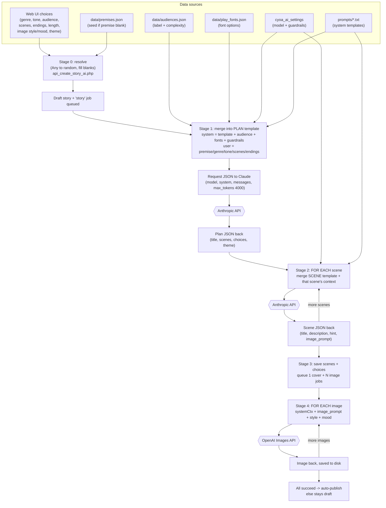

# How an AI Prompt Comes Together — Full-Story Creation

A plain-English + technically-accurate trace of how the app assembles the prompts for a
**"Create a full story with AI"** job: which data is collected, where it comes from, how it is
merged into a template, the exact JSON sent to the AI service, the JSON that comes back, and how the
whole thing loops once per image.

> This is a **current** reference (matches the code as of the v7 build). It doubles as a source
> document for tools like Google NotebookLM — it is deliberately self-contained.

---

## 1. The pipeline in one breath

A full-story request is **not a single AI call.** It is a small assembly line:

1. The **web UI** collects the user's choices.
2. The server **resolves** anything left as "Any" into a concrete value and fills blanks from seed data.
3. **Call 1 — Plan:** merge a template + supporting data + the user's values → JSON request → Claude → a story *plan* (titles, summaries, branching choices) comes back as JSON.
4. **Calls 2…N — Scenes:** for **each** scene in the plan, merge a second template with that scene's context → JSON request → Claude → the written scene comes back as JSON.
5. The results are saved, and **child image jobs are queued** (one cover + one per scene that has an image prompt).
6. **Calls N+1…M — Images:** for **each** image, merge an image template + the scene's image prompt + style/mood → request → OpenAI → an image comes back.

So one "story" request fans out into **1 plan call + (one call per scene) + (one call per image).**

---

## 2. Where the data comes from (the sources that get merged)

| Source | Provides | Mechanism |
|---|---|---|
| **Web UI** (`editor.php` "Use AI" panel) | premise (from the Description field), genre, tone, audience, # scenes, # endings, scene word length, image style/mood/quality, theme + fonts + colours, layout, publish flag, and the `gen_*` "let AI write this" checkboxes | `submitStoryCreate()` builds a `FormData` POST |
| **`data/premises.json`** | a seed premise when the user leaves premise blank | `ai_pick_seed()` (genre-filtered, or whole list for "Any") |
| **`data/audiences.json`** | the audience **label** + **complexity** writing guidance | `resolve_audience()` |
| **`data/play_fonts.json`** | the mood→font-family "font options" block (so the AI picks a real, on-list font) | `play_fonts_mood_map()` → `build_font_options_block()` |
| **`cyoa_ai_settings`** (DB) | the Claude model, the **content guardrails** text, image model/quality/format, timeouts | `app_setting('key')` |
| **`prompts/*.txt`** | the **system-prompt templates** with `{PLACEHOLDER}` tokens | `load_prompt(name, vars)` |

Note: the **theme** (colours + fonts) is collected and stored, but is **never** put into any prompt —
it's purely visual. The semantic hint the AI receives is the **genre**.

---

## 3. Stage 0 — Submission resolution (`api_create_story_ai.php`)

Before any AI call, the server normalizes the form into a concrete `input_json`:

- **"Any" → random, in code:** `ai_resolve_story_params()` turns an "Any" genre / tone / audience into a concrete random value, and fills a **blank premise** from a `premises.json` seed.
- **Blank image style → one random style** for the whole story (`ai_random_image_style()`), so every image matches.
- **User's own title/description** are kept when the matching `gen_*` box is off.
- A **draft story row** is created (so a `storyID` exists) and a **`job_type = 'story'`** row is queued with this `input_json`.

The dispatcher later hands the job to a worker, which routes it to `cron/ai_story_handler.php`.

---

## 4. Stage 1 — The PLAN prompt (Claude call #1)

This is the clearest example of "many sources merging into a template."

### 4a. Build the **system prompt** (`build_plan_system_prompt()`)
```
load_prompt('story_plan_system', {
    target_scenes,        ← from UI
    num_endings,          ← from UI
    audience_label,       ← data/audiences.json
    audience_complexity,  ← data/audiences.json
    font_options          ← data/play_fonts.json (mood → families)
})
  + guardrail_prompt_suffix()   ← cyoa_ai_settings (guardrails_text), appended only when enabled
```
`load_prompt()` reads `prompts/story_plan_system.txt` and substitutes each `{placeholder}`. The
**guardrail suffix** is then concatenated onto the end:
```
Content guardrails: Never generate content involving: <topics>. If any part of your response
would involve these topics, include a "red_flag" field in your JSON response with the name of
the breached topic as its string value.
```

### 4b. Build the **user prompt** (just the user's values)
```
Premise: "<premise>"
Genre: <genre>
Tone: <tone>
Target number of scenes: <n>
Number of endings: <n>
```

### 4c. Merge into the **final request JSON** sent to the AI (`claude_api_call()`)
```jsonc
POST https://api.anthropic.com/v1/messages
Headers: x-api-key, anthropic-version: 2023-06-01
{
  "model":       "<anthropic_model from settings>",
  "max_tokens":  4000,
  "system":      "<the assembled system prompt from 4a>",
  "messages":    [ { "role": "user", "content": "<the user prompt from 4b>" } ],
  "temperature": 1.0          // only included for models that accept it
}
```

### 4d. The response (JSON back from Claude)
A plan: `{ title, description, theme{…}, scenes:[ { temp_id, title, summary, scene_type, choices:[{text, dest_temp_id}] } ] }`.
The server then:
- **Checks the guardrail:** if the model returned a non-empty `red_flag`, the job is aborted (`guardrail_check_response()`).
- If the body wasn't valid JSON, it **retries once** ("Return ONLY the JSON object…").
- **Validates + sanitizes** the plan (`validate_story_plan()`): strips tags, clamps lengths, drops choices whose destination doesn't exist, resolves the theme.

---

## 5. Stage 2 — The SCENE prompts (Claude calls #2…N, one per scene)

For **each** scene in the plan, `write_scene_content()` assembles a fresh prompt:

- **System prompt** = `load_prompt('story_scene_writer_system', { scene_type, tone, word_length, audience_label, audience_complexity })` + `guardrail_prompt_suffix()`.
- **User prompt** (`build_scene_writer_user_prompt()`) gives the model the whole map plus the one scene to write:
  ```
  Story: "<title>"
  Description: <description>

  Full story structure:
    [sp_1] <title> (opening): <summary> → [choice texts]
    [sp_2] <title> (mid_story): <summary> → [...]
    ...
  Now write scene [sp_k]: <summary>
  Scene type: <type>
  Choices leading out of this scene:
    - "<choice text>" → [sp_j] <destination summary>
  ```
- **Request JSON:** same shape as 4c, but `max_tokens: 1200`, `temperature: 0.8`.
- **Response:** `{ title, description (HTML-limited), hint, image_prompt }`, guardrail-checked and sanitized.

This call repeats **once per scene** (e.g. ~8–16 times for a typical story).

---

## 6. Stage 3 — Apply, then queue images (`ai_apply.php`)

The plan + written scenes are written to the DB (scene rows, choice rows with `temp_id → real
sceneID` remapping). Then, if images were included, the app **queues child `image` jobs**: one for
the **cover** plus one for **each scene that produced an `image_prompt`**. Each child job carries the
resolved style/mood and `parent_job_id` pointing back at the story job.

---

## 7. Stage 4 — The IMAGE prompts (OpenAI calls, one per image)

For **each** image job, `ai_image_handler.php` composes:
```php
$systemCtx  = load_prompt( isCover ? 'cover_image_system' : 'image_system' );  // NO theme
$stylePart  = $style ? " in {$style} style" : ($category ? " in {$category} style" : '');
$moodPart   = $mood  ? ", {$mood}" : '';
$fullPrompt = $systemCtx . "\n\n" . $imagePrompt . $stylePart . $moodPart;
```
That `$fullPrompt` is sent to the OpenAI image model (from settings); the returned image is downloaded
and saved to `images/stories/{storyID}/`. This repeats **once per image** (cover + scenes).

When the parent job and **all** image children succeed — and the publish flag was set — the story
**auto-publishes** (`maybe_publish_created_story()`); any failure leaves it a draft.

---

## 8. The "it repeats" math

For a story with **S** scenes and **I** images (cover + scenes that have prompts):

```
Total AI calls = 1 (plan)  +  S (one per scene, Claude)  +  I (one per image, OpenAI)
```

The plan call is **one**; the scene and image calls are **loops**.

---

## 9. Visualization — Mermaid flowchart (data → merge → AI → loop)

> Render in VS Code (Mermaid preview), https://mermaid.live, or GitHub. Export to PNG/SVG there.



---

## 10. Visualization — Mermaid sequence diagram (the round-trips)

```mermaid
sequenceDiagram
    participant U as Browser (editor.php)
    participant API as api_create_story_ai.php
    participant Q as Job queue (DB)
    participant W as Worker (ai_story_handler)
    participant C as Anthropic API
    participant O as OpenAI API

    U->>API: POST form (premise, genre, tone, images, ...)
    API->>API: resolve "Any"→random, fill blank premise from seed
    API->>Q: create draft story + 'story' job
    API-->>U: { ok, storyID, jobID }

    Note over W: dispatcher → worker picks up the job
    W->>C: Plan request (template+audience+fonts+guardrails + user vars)
    C-->>W: Plan JSON (scenes, choices, theme)

    loop one call per scene
        W->>C: Scene request (scene template + story map + this scene)
        C-->>W: Scene JSON (title, description, hint, image_prompt)
    end

    W->>Q: save scenes/choices; queue cover + per-scene image jobs

    loop one call per image
        W->>O: Image request (image template + image_prompt + style + mood)
        O-->>W: Image bytes → saved to images/stories/{id}/
    end

    Note over W,Q: all jobs succeed + publish flag → auto-publish
```
